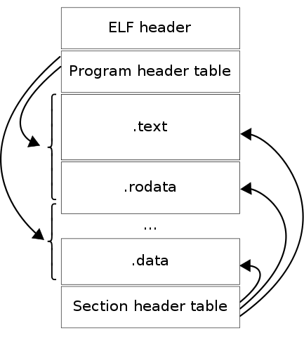

# Step 2: Meet Your `sample_app`{{}}
Before we continue on our profiler building journey, let's take a moment to get familiar with our example application `sample_app`{{}}.
This humble little piece of software will serve as our experimental subject as we explore ELF, DWARF, and the magic of eBPF.

### Browsing the Source Code

To explore the code, you can either use the killercoda built-in editor theia conveniently available for you in the left-most tab `Editor`{{}},
or you can take a peak directly on [github.com](https://github.com/Cropsey/lysefgt/tree/code/code/sample_app).

```
cd /root/lysefgt/code/sample_app
```{{exec}}

It is just a single source file, with one `main`{{}} function as program entry executing in endless loop calling two other functions, 
`easyToFindFunctionName`{{}} and `alsoEasyToFindFunctionName`{{}}.

The `Makefile`{{}} instructs Go compiler to not perform any build optimizations and keeps the default behaviour of not stripping debug
symbols from the binary.
```
go build -gcflags '-l' -o sample_app ./main.go
```
While it is technically possible to a certain degree to profile optimized binaries without debug symbols,
it's much more convenient to at least keep the debug symbols for the tradeoff of a bigger binary. Turning off build optimizations
can have negative performance effect, but it introduces additional challanges for the profiler and `sample_app` doesn't care about
performance.

### Reading the Binary `sample_app`{{}}

In order to be able to write a profiler, it's useful to be familiar with a binary format of the executables. Go language has very
convenient toolchain to help us dive into the compiled binary.

```
go tool objdump -s '^main' ./sample_app
go tool objdump ./sample_app | wc -l
```{{exec}}

Given how small our codebase is, you are probably surprised by the size of `objdump`{{}}. As mentioned before, Go has a runtime 
which is bundled in every binary for them to be self-contained. You can tell `objdump`{{}} to display only symbols matching a
regular expression, that is exactly what the first command does with `-s '^main'`{{}}. If you want to see all ~115.000 lines, you
can drop the `-s`{{}} flag.

We will focus on the last three `TEXT`{{}} sections that are relevant to the codebase of `sample_app`{{}}:

```
TEXT main.easyToFindFunctionName(SB) /root/lysefgt/code/sample_app/main.go
  main.go:10        0x457460                493b6610                CMPQ 0x10(R14), SP
  ...
  main.go:18        0x47e021                c3                      RET
  ...

TEXT main.alsoEasyToFindFunctionName(SB) /root/lysefgt/code/sample_app/main.go
  main.go:20        0x47e040                493b6610                CMPQ 0x10(R14), SP
  ...
  main.go:28        0x47e0a1                c3                      RET
  ...

TEXT main.main(SB) /root/lysefgt/code/sample_app/main.go
  main.go:30        0x47e0c0                493b6610                CMPQ 0x10(R14), S
  ...
  main.go:32        0x47e0d2                e8e9feffff              CALL main.easyToFindFunctionName(SB)
  main.go:33        0x47e0d7                e864ffffff              CALL main.alsoEasyToFindFunctionName(SB)
  ...
```

The `TEXT`{{}} section marks a beginning of particular symbol, for example following line:
```
TEXT main.easyToFindFunctionName(SB) /root/lysefgt/code/sample_app/main.go
```
This means that symbol `main.easyToFindFunctionName`{{}} which refers to `easyToFindFunctionName()`{{}} function in
`main`{{}} package can be found in `/root/lysefgt/code/sample_app/main.go`{{}} source file.

```
  main.go:10        0x457460                493b6610                CMPQ 0x10(R14), SP
```
This tells us an assembly language instruction `CMPQ 0x10(R14), SP`{{}} is at memory address `0x457460`{{}} in hexadecimal,
which corresponds to line `10`{{}} of source code file `main.go`{{}}. The third column is the machine code for the instruction.

You may notice there are multiple instructions mapped to the same line of the source code file. While by some, Go is considered
to be a rather verbose programming language, it still is significantly more compact than assembly.

The `objdump`{{}} combines both ELF and DWARF into an output that is easier to understand and more than sufficient for the
scope of the workshop. But if you are interested in seeing ELF and DWARF much closer to the raw representation, you can use
following commands, but beware, there will be a lot of lines.

### ELF
Abbreviation for [Executable and Linkable Format](https://en.wikipedia.org/wiki/Executable_and_Linkable_Format) and in
layman terms can be described as format for structuring executable instructions and adding some helpful metadata.



[image source](https://en.wikipedia.org/wiki/Executable_and_Linkable_Format)

```
readelf -a ./sample_app > elfdump
cat elfdump | wc -l
# elf output stored in a file ./elfdump
```{{exec}}

Full ELF dump is pretty large, there are some basic headers and metadata about the executable, where to begin the
execution of the binary - address of the entry point, and where to find sections.
```
ELF Header:
Magic:   7f 45 4c 46 02 01 01 00 00 00 00 00 00 00 00 00
Class:                             ELF64
Data:                              2's complement, little endian
...
Entry point address:               0x45bfa0
Start of program headers:          64 (bytes into file)
Start of section headers:          456 (bytes into file
```
You can correlate how our `go tools objdump`{{}} maps to the `0x45bfa0` entry point address:
```
go tool objdump ./sample_app | grep -B1 0x45bfa0
```{{exec}}
which shows it's a `JMP`{{}} instruction to `_rt0_amd64`{{}}
```
TEXT _rt0_amd64_linux(SB) /usr/local/go/src/runtime/rt0_linux_amd64.s
  rt0_linux_amd64.s:8   0x45bfa0                e91bc6ffff              JMP _rt0_amd64(SB)
```
and when we look a little deeper
```
go tool objdump ./sample_app | grep -A3 'TEXT _rt0_amd64(SB)'
```{{exec}}
another jump, to `runtime.rt0_go.abi0(SB)`{{}}, the format of the symbol should start looking a bit more familiar with 
[Go core `runtime`{{}}](https://pkg.go.dev/runtime) package.
```
TEXT _rt0_amd64(SB) /usr/lib/go/src/runtime/asm_amd64.s
  asm_amd64.s:16        0x45b8e0                488b3c24                MOVQ 0(SP), DI
  asm_amd64.s:17        0x45b8e4                488d742408              LEAQ 0x8(SP), SI
  asm_amd64.s:18        0x45b8e9                e912000000              JMP runtime.rt0_go.abi0(SB)
```
You can try to trace the assembly all the way to `main.main`{{}}.

The symbol table contains all exported symbols, we are mainly interested in observing symbols regarding our supposedly easy to find functions.
```
Symbol table '.symtab' contains 2057 entries:
   Num:    Value          Size Type    Bind   Vis      Ndx Name
...
  1443: 000000000047dfc0   119 FUNC    GLOBAL DEFAULT    1 main.easyToFindFunctionName
  1444: 000000000047e040   119 FUNC    GLOBAL DEFAULT    1 main.alsoEasyToFindFunctionName
...
```

### DWARF
Standard for storing additional [debug information](https://en.wikipedia.org/wiki/DWARF) in your executable binary file.
```
readelf -w ./sample_app > dwarfdump
cat dwarfdump | wc -l
# dwarf output stored in a file ./dwarfdump
```{{exec}}
If you think there is a lot of ELF, wait till you see the DWARF dump. To highlight a region of our interest,
we would like to take a closer look at this `CompilationUnit`{{}} for the `main`{{}} program:

```
<1><7d130>: Abbrev Number: 0
  Compilation Unit @ offset 0x7d131:
...
 <0><7d13c>: Abbrev Number: 1 (DW_TAG_compile_unit)
    <7d13d>   DW_AT_name        : main
    <7d142>   DW_AT_language    : 22  (Go)
    <7d147>   DW_AT_low_pc      : 0x47dfc0
    <7d14f>   DW_AT_ranges      : 0x2f010
    <7d153>   DW_AT_comp_dir    : .
    <7d155>   DW_AT_producer    : Go cmd/compile go1.18; -l regabi
...
```

The `CompilationUnit`{{}} contains many parts, our `main.easyToFindFunctionName`{{}} is defined as `Subprogram`{{}}. 
Which is a little confusing name for classification of Go functions but that is how DWARF is organized and it is a format
that supports providing debug information for many different languages.

```
...
 <1><7d17b>: Abbrev Number: 3 (DW_TAG_subprogram)
    <7d17c>   DW_AT_name        : main.easyToFindFunctionName
    <7d198>   DW_AT_low_pc      : 0x47dfc0
    <7d1a0>   DW_AT_high_pc     : 0x47e037
    <7d1aa>   DW_AT_decl_file   : 0x2
...
 <1><7d1df>: Abbrev Number: 3 (DW_TAG_subprogram)
    <7d1e0>   DW_AT_name        : main.alsoEasyToFindFunctionName
    <7d200>   DW_AT_low_pc      : 0x47e040
    <7d208>   DW_AT_high_pc     : 0x47e0b7
    <7d212>   DW_AT_decl_file   : 0x2
...
```
And this is how in our DWARF (relevant tiny part of) the source code is represented. Directories are
in the `Directory Table`{{}} and the `File Name Table`{{}} containing file names references the directory table.
```
...
 The Directory Table (offset 0x2f5bc):
  1 /root/lysefgt/code/sample_app
  2 /usr/local/go/src/fmt

 The File Name Table (offset 0x2f5f1):
  Entry Dir Time  Size  Name
  1 0 0 0 <autogenerated>
  2 1 0 0 main.go
  3 2 0 0 print.go
...
```

In the next step, we will take a closer look at the `profiler`{{}}. We will start slow by connecting
a few syscalls and doing something rather silly, but it will get to be a useful piece of software
eventually.
