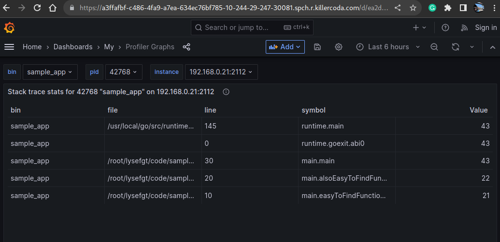

# Step 4: Stats and Tables for Everyone
The aggregated stats on stdout from our profiler in [part 1](https://killercoda.com/wozniakjan/course/killercoda/part1)
were ok as insight to single application, but for multiple processes, that is much less convenient.

You can open the [prometheus]({{TRAFFIC_HOST1_30080}}) window again and try a few queries or even better,
craft your own queries and statistics:
```
# to filter only functions that were defined as part of our codebase
sort_desc (sum by(bin,pid,symbol,file,line)(profiler_aggregated{file=~".*lysefgt.*"}))

# to filter only functions for sample_app 
sort_desc (sum by(symbol,file,line)(profiler_aggregated{bin="sample_app"}))
```{{}}

And there is a single [grafana dashboard]({{TRAFFIC_HOST1_30081}}), allowing to perform
some [ClickOps](https://docs.cloudposse.com/glossary/clickops/), but the grafana instance
is fully open and unrestricted allowing you to develop your own dashboards. Can you
create a [flame graph](https://www.brendangregg.com/flamegraphs.html) from the data?


